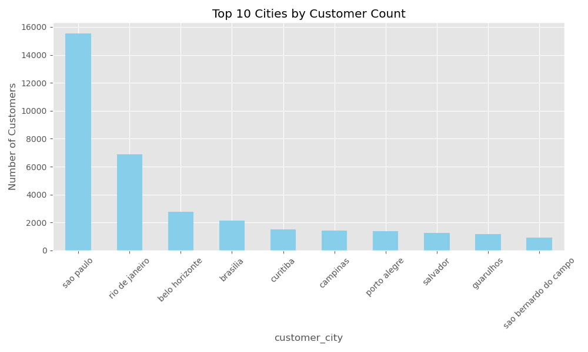
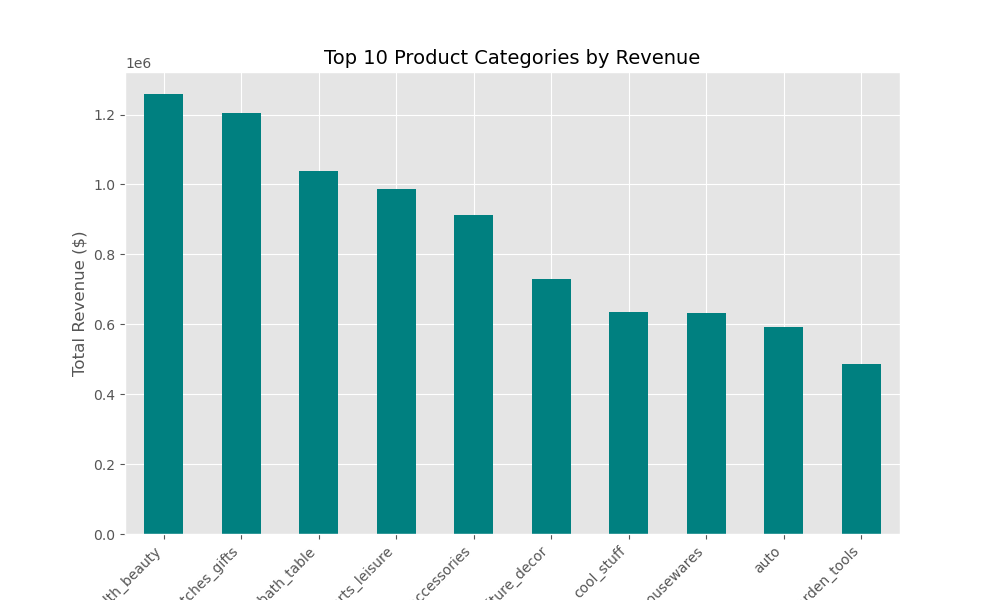
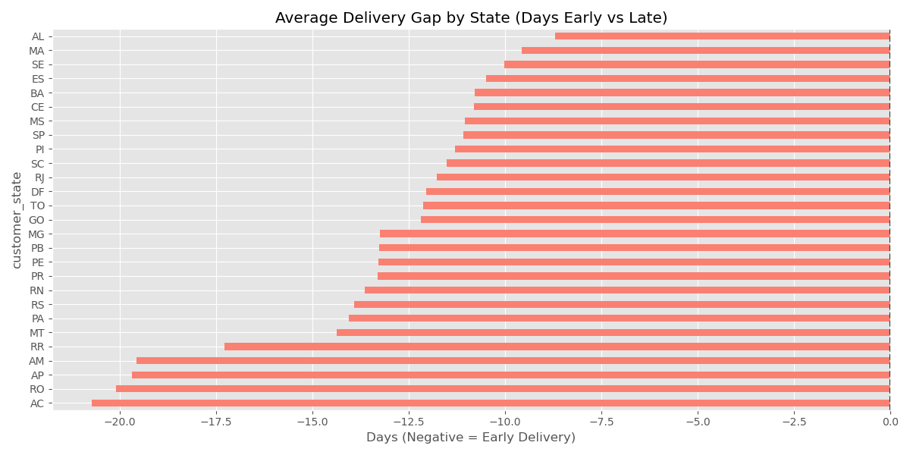
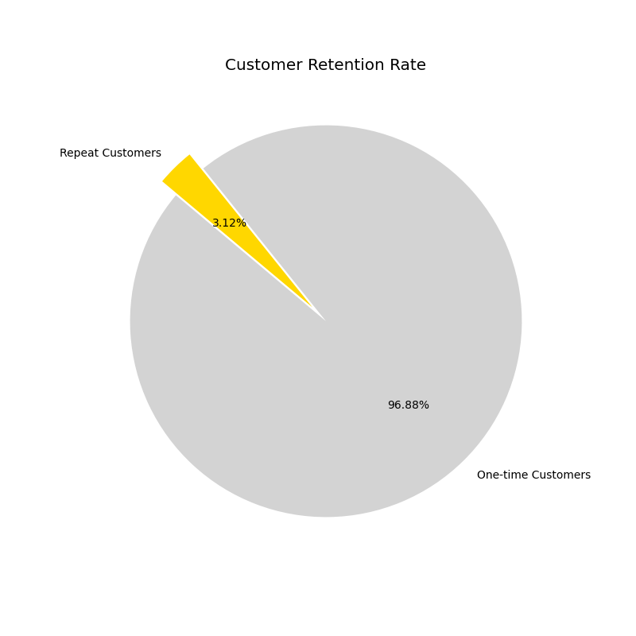

📊 Brazilian E-Commerce Growth & Logistics Analysis
------------------------------------------------------------------------------------------------------------------------------------------------------------------

🎯 Project Objective
-------------------------------------------------------------------------------------------------------------------------------------------------------------------
This project analyzes 100,000+ orders from the Olist e-commerce platform (2016-2018) to identify revenue drivers and logistics inefficiencies. The goal was to provide actionable growth recommendations regarding customer retention and delivery performance.

🛠️ Tech Stack
-------------------------------------------------------------------------------------------------------------------------------------------------------------------
Language: Python

Libraries: Pandas (Data Cleaning & Merging), Matplotlib (Visualization), NumPy.

🚀 Key Business Insights
-------------------------------------------------------------------------------------------------------------------------------------------------------------------
1. The "Acre Paradox" (Logistics Opportunity) -
   
Discovery: Logistics performance is beating estimates by a massive margin. In the state of Acre (AC), packages arrive 20.7 days earlier than the promised date.

Impact: Conservative delivery estimates at checkout may be scaring away potential customers who want faster shipping.

2. Revenue Drivers -
   
Top Category: Health & Beauty is the dominant revenue generator, followed by Watches & Gifts.

Insight: Marketing budget should be reallocated from low-performing categories (like "Security & Services") into these "winners."

3. The Retention Gap -
   
The Metric: Found a 3.12% customer retention rate.

Analysis: Despite 100% of states beating delivery deadlines, customers are not returning for second purchases. This indicates a need for post-purchase loyalty programs rather than faster shipping.
-------------------------------------------------------------------------------------------------------------------------------------------------------------------
📈 Visualizations
-------------------------------------------------------------------------------------------------------------------------------------------------------------------

💡 Strategic Recommendations
-------------------------------------------------------------------------------------------------------------------------------------------------------------------
Conversion: Update "Estimated Delivery Dates" to reflect actual performance, increasing checkout conversion rates.

Retention: Trigger automated loyalty discounts the moment an "early delivery" is detected to capture positive customer sentiment.

Expansion: Target digital ads in Northern states where logistics speed is already a competitive advantage.

